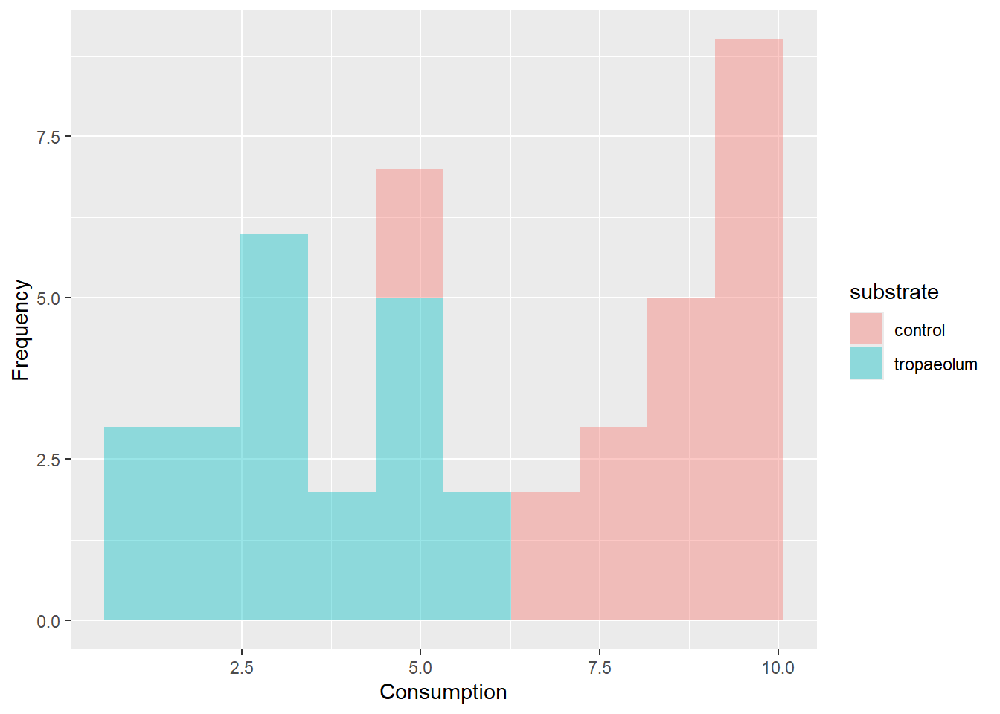
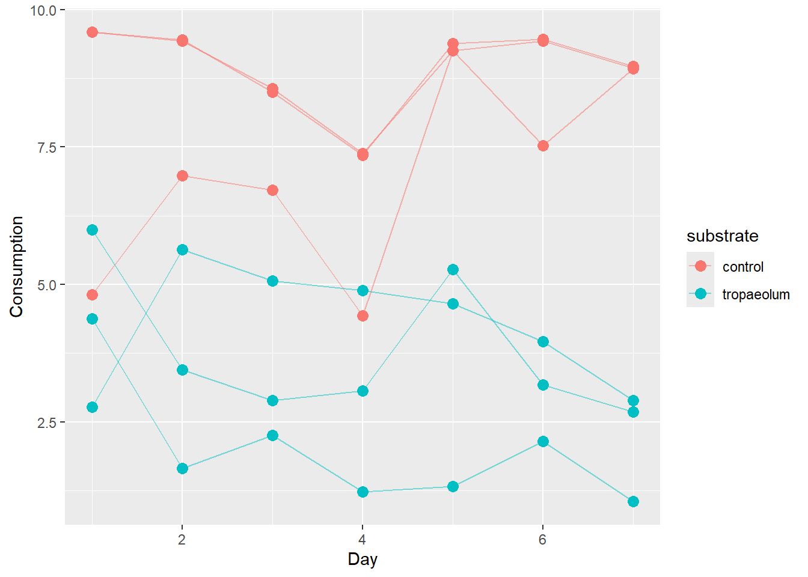
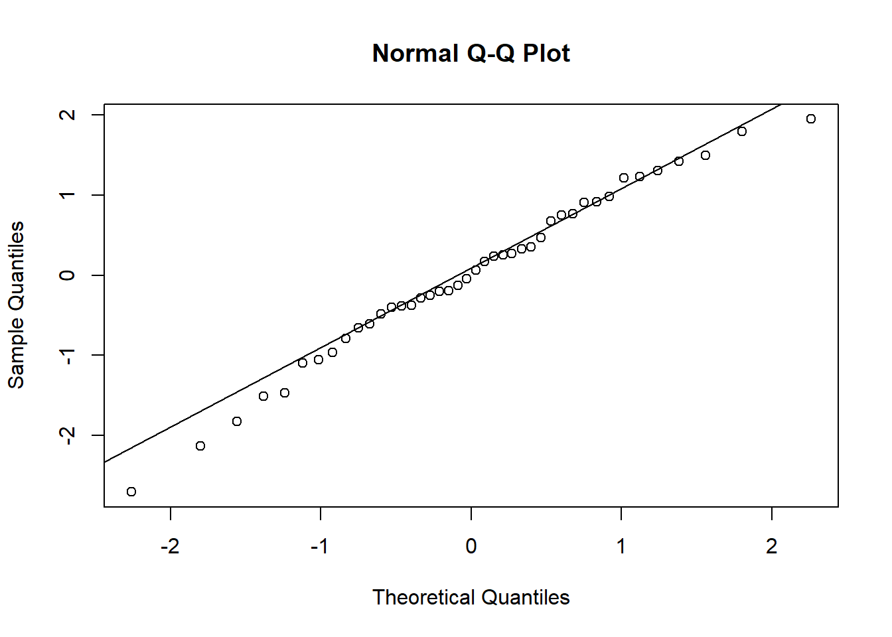
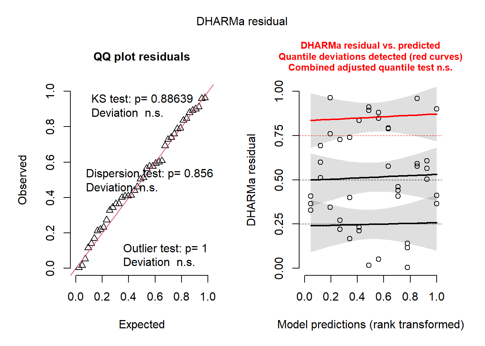
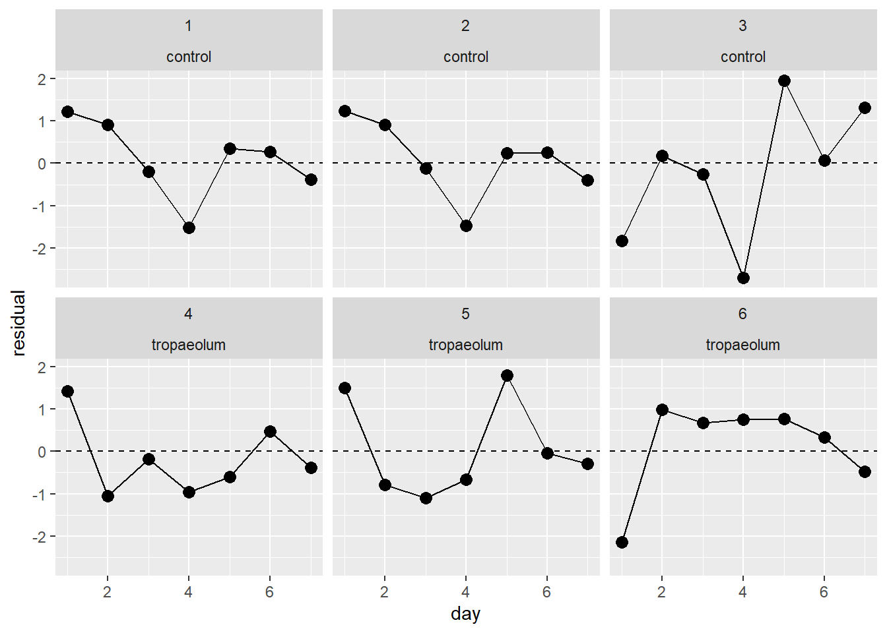
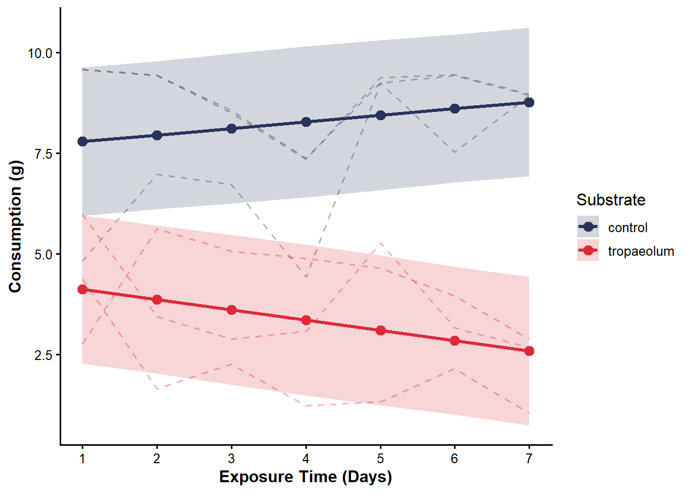
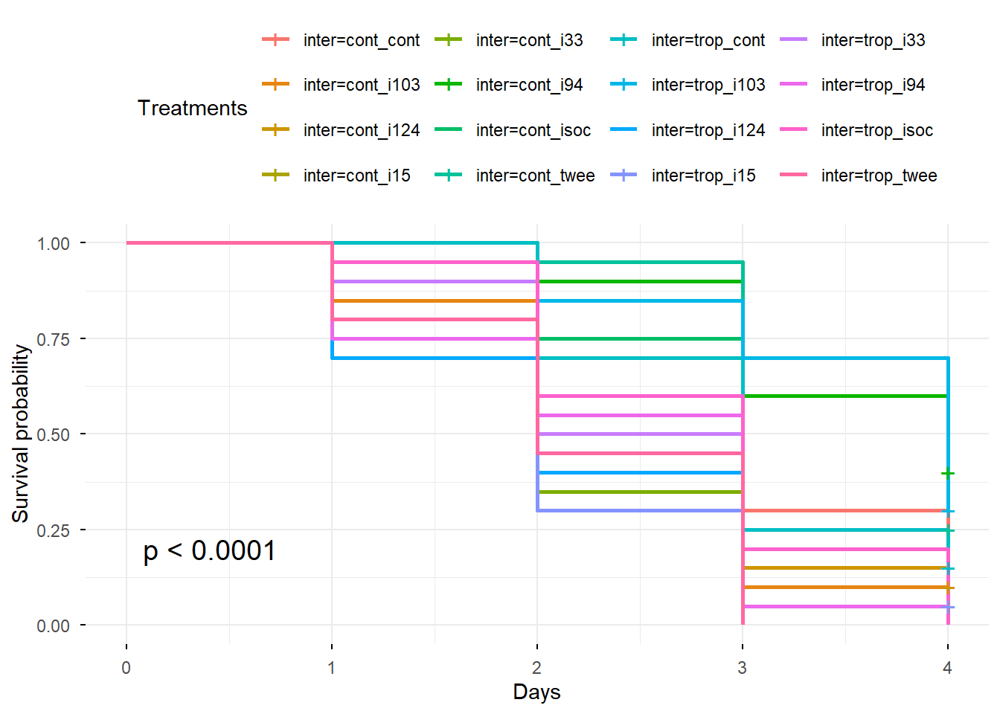
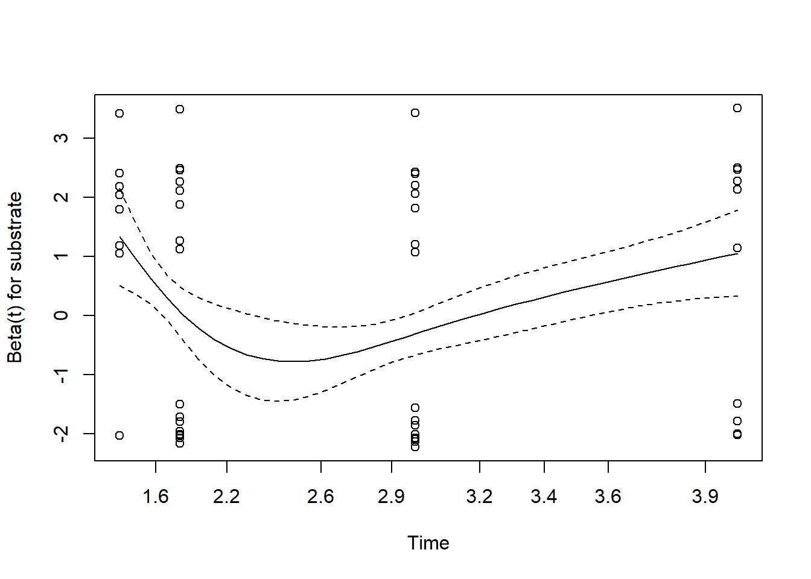
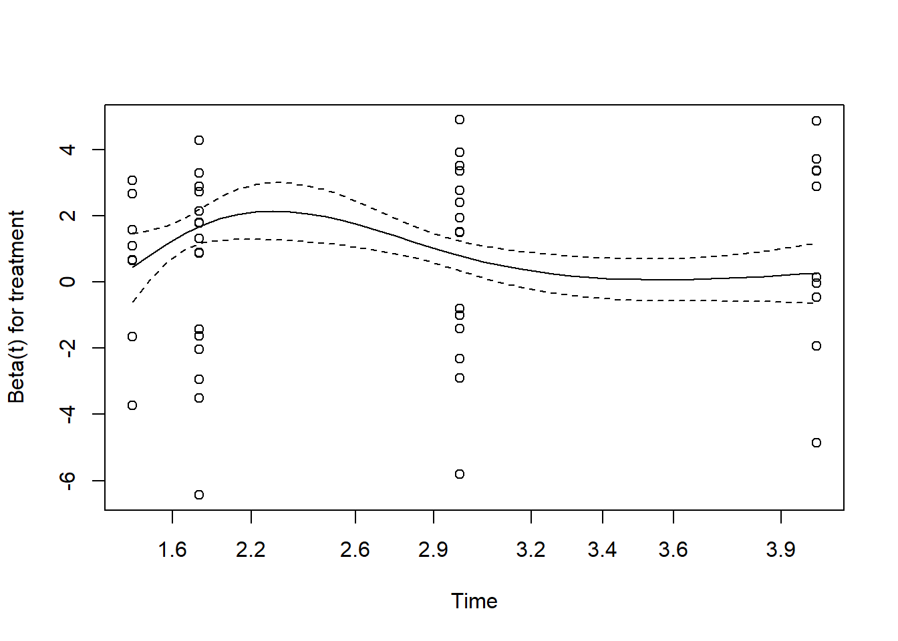
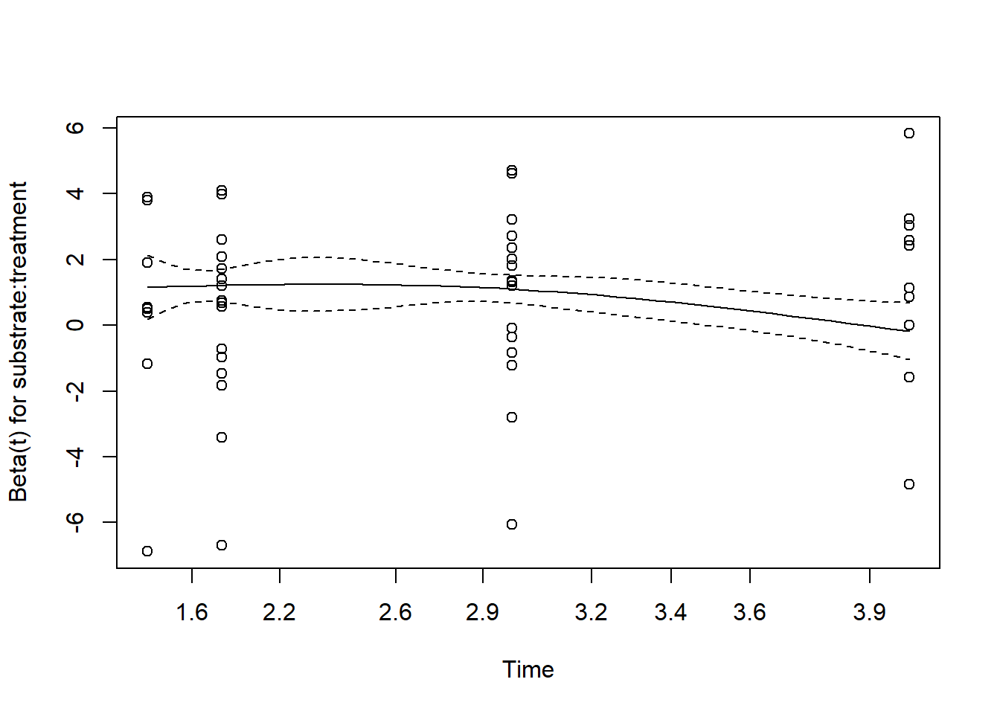

# Isolates selection

## Rationale

The first phase of this study aimed to **select an entomopathogenic fungal isolate** to evaluate how a toxic substrate affects the collective immune defense of *Atta sexdens*.

Pathogenicity was evaluated on *A. sexdens* foragers exposed to five *Metarhizium robertsii* isolates—kindly provided by the *Laboratório de Interações Inseto-Microrganismos* at the *Universidade Federal de Viçosa*.

Twenty-four hours prior to the bioassays, colonies were starved. Following starvation, **colonies were randomly assigned to two groups and exposed to one of two substrate regimes for seven days**: (i) 10.0 g of *Acalypha wilkesiana* leaves daily (control group), or (ii) 10.0 g of fresh *Tropaeolum majus* leaves daily, serving as a potential modulating agent of social defenses.

After this period, **individual ants from these colonies were immersed for two seconds in a conidial suspension** at a concentration of 1x10⁶ conidia/mL, containing distilled water and 0.01% Tween 80. **Three control groups were evaluated**: (1) an aqueous solution of 0.01% Tween 80 (vehicle control), (2) distilled water (negative control), and (3) a 0.0001% isocycloseram solution (positive control). Each treatment consisted of four replicates (Petri dishes) with five foragers each. Ants were housed in Petri dishes lined with moistened filter paper and maintained in a BOD incubator at 27 ± 2 °C, 70 ± 10% relative humidity, and continuous darkness (0:24 h L:D). The ants were starved throughout the **4-day evaluation period**, and mortality was recorded daily. Dead individuals were immediately removed and transferred to individual moist chambers (microcentrifuge tubes containing cotton and autoclaved distilled water) to evaluate fungal sporulation (confirming mycosis).

## Statistical analysis

The statistical analysis for the pathogenicity bioassay data was conducted in R using a multi-step framework. Survival curves were generated using the Kaplan–Meier estimator and compared across isolates and controls via the log-rank test to evaluate daily mortality rates. To quantify the hazard ratios (HR) of substrate type, fungal treatment, and their interaction (substrate:treatment), a mixed-effects Cox proportional hazards model (`coxme`) was fitted, specifying the Petri dish (replicate) as a random effect to account for pseudo-replication. Finally, the median lethal time (LT₅₀) for each treatment combination was estimated using dose-response modeling via the `drc` package.

## Results

Installing and loading packages.


::: {.cell}

```{.r .cell-code}
library(readxl) #leitura de arquivos excel
library(dplyr) #manipulação dos dados
library(survival) #análise de sobrevivência
library(survminer) #gráficos de sobrevivência
#install.packages("coxme")
library(coxme) #modelo de cox com efeitos aleatórios
library(lme4) #modelos lineares generalizados mistos (glmm)
library(lmerTest)
library(car) #ANOVA tipo III para glmm
#install.packages("emmeans")
library(emmeans) #comparações mútiplas post-hoc
#install.packages()
library(drc) #curvas dose-resposta e cálculo de TL50
library(tidyverse) #manipulação, visualização e análise de dados
#install.packages("DHARMa")
library(DHARMa)
```
:::


### Foraging data

#### Descritive statistic

Descriptive statistics were calculated for each substrate and day, using colony-level observations as the experimental units.


::: {.cell}

```{.r .cell-code}
foraging_exp1 <- read_excel("foraging_bioassay_1.xlsx")

#estatística descritiva
descritiva <- foraging_exp1 %>%
  group_by(substrate, day) %>%
  summarise(
    n = n(),
    media = mean(real_consume, na.rm = TRUE),
    sd = sd(real_consume, na.rm = TRUE),
    se = sd(real_consume, na.rm = TRUE) / sqrt(n),
    mediana = median(real_consume, na.rm = TRUE),
    .groups = "drop"
  )

descritiva
```

::: {.cell-output .cell-output-stdout}

```
# A tibble: 14 × 7
   substrate    day     n media     sd     se mediana
   <chr>      <dbl> <int> <dbl>  <dbl>  <dbl>   <dbl>
 1 control        1     3  8    2.75   1.59      9.59
 2 control        2     3  8.62 1.42   0.820     9.43
 3 control        3     3  7.93 1.05   0.604     8.5 
 4 control        4     3  6.39 1.69   0.978     7.35
 5 control        5     3  9.29 0.0751 0.0433    9.25
 6 control        6     3  8.81 1.11   0.638     9.43
 7 control        7     3  8.95 0.0208 0.0120    8.94
 8 tropaeolum     1     3  4.38 1.61   0.930     4.38
 9 tropaeolum     2     3  3.58 1.99   1.15      3.45
10 tropaeolum     3     3  3.41 1.47   0.851     2.89
11 tropaeolum     4     3  3.06 1.83   1.06      3.07
12 tropaeolum     5     3  3.75 2.12   1.22      4.65
13 tropaeolum     6     3  3.09 0.907  0.524     3.17
14 tropaeolum     7     3  2.21 1.01   0.582     2.68
```


:::

```{.r .cell-code}
#histograma
ggplot(foraging_exp1, aes(x = real_consume, fill = substrate)) +
  geom_histogram(bins = 10, alpha = 0.4) +
  labs(x = "Consumption", y = "Frequency")
```

::: {.cell-output-display}
{width=672}
:::

```{.r .cell-code}
#dispersion 
ggplot(foraging_exp1, aes(x = day, y = real_consume, color = substrate, group = colony)) +
  geom_line(alpha = 0.5) +
  geom_point(size = 3) +
  labs(x = "Day", y = "Consumption")
```

::: {.cell-output-display}
{width=672}
:::
:::


#### Inferencial statistics

Foraging activity data were analyzed using a linear mixed-effects model fitted with the `lmer` function. Experimental day was centered by subtracting 1 from the original day variable, so that day 1 represented time zero, facilitating the interpretation of the model intercept and treatment effects at the beginning of the experiment. The model included substrate, day, and their interaction as fixed effects, with colony included as a random intercept to account for the non-independence of repeated observations from the same colony. Model assumptions were assessed through visual inspection of residuals and Q–Q plots, the Shapiro–Wilk test for residual normality, and simulation-based residual diagnostics using the `DHARMa` package. Temporal dependence was further explored by examining residual autocorrelation within each colony using the autocorrelation function (ACF). Type III analysis of variance with Kenward–Roger-adjusted degrees of freedom was used to test the significance of the fixed effects. Estimated marginal means were obtained using the `emmeans` package to characterize predicted consumption for each substrate across experimental days, while `emtrends` was used to compare the temporal slopes of consumption between substrates, allowing assessment of whether consumption changed at different rates over time depending on substrate.


::: {.cell}

```{.r .cell-code}
#centralização da variável para estabelecer o dia 1 como o tempo 0
foraging_exp1 <- foraging_exp1 %>%
  mutate(day_c = day - 1)

#ajustando o modelo linear misto
modelo <- lmer(
  real_consume ~ substrate * day_c + (1 | colony),
  data = foraging_exp1
)
plot(modelo)
```

::: {.cell-output-display}
{width=672}
:::

```{.r .cell-code}
#verificando a normalidade dos resíduos do modelo
print(shapiro.test(residuals(modelo)))
```

::: {.cell-output .cell-output-stdout}

```

	Shapiro-Wilk normality test

data:  residuals(modelo)
W = 0.98424, p-value = 0.821
```


:::

```{.r .cell-code}
qqnorm(residuals(modelo))
qqline(residuals(modelo))
```

::: {.cell-output-display}
{width=672}
:::

```{.r .cell-code}
simres <- simulateResiduals(modelo)
plot(simres)
```

::: {.cell-output-display}
{width=672}
:::

```{.r .cell-code}
#organizando os resíduos do modelo
residuos <- data.frame(
  colony = foraging_exp1$colony,
  substrate = foraging_exp1$substrate,
  day = foraging_exp1$day,
  residual = residuals(modelo)
)

residuos %>%
  arrange(colony, day)
```

::: {.cell-output .cell-output-stdout}

```
   colony  substrate day    residual
1       1    control   1  1.21722581
7       1    control   2  0.91365438
13      1    control   3 -0.19991705
19      1    control   4 -1.51348848
25      1    control   5  0.35294009
31      1    control   6  0.26936866
37      1    control   7 -0.38420276
2       2    control   1  1.23198762
8       2    control   2  0.90841619
14      2    control   3 -0.12515524
20      2    control   4 -1.46872667
26      2    control   5  0.23770191
32      2    control   6  0.25413048
38      2    control   7 -0.39944095
3       3    control   1 -1.82564200
9       3    control   2  0.17078657
15      3    control   3 -0.25278486
21      3    control   4 -2.70635628
27      3    control   5  1.95007229
33      3    control   6  0.06650086
39      3    control   7  1.30292943
4       4 tropaeolum   1  1.42045580
10      4 tropaeolum   2 -1.05442515
16      4 tropaeolum   3 -0.18930610
22      4 tropaeolum   4 -0.96418705
28      4 tropaeolum   5 -0.60906801
34      4 tropaeolum   6  0.46605104
40      4 tropaeolum   7 -0.37882991
5       5 tropaeolum   1  1.49645734
11      5 tropaeolum   2 -0.78842361
17      5 tropaeolum   3 -1.09330457
23      5 tropaeolum   4 -0.65818552
29      5 tropaeolum   5  1.79693353
35      5 tropaeolum   6 -0.04794742
41      5 tropaeolum   7 -0.28282838
6       6 tropaeolum   1 -2.13441314
12      6 tropaeolum   2  0.98070591
18      6 tropaeolum   3  0.67582495
24      6 tropaeolum   4  0.75094400
30      6 tropaeolum   5  0.76606305
36      6 tropaeolum   6  0.33118210
42      6 tropaeolum   7 -0.48369886
```


:::

```{.r .cell-code}
#plot dos resíduos do modelo ao longo dos dias
ggplot(residuos, aes(x = day, y = residual)) +
  geom_hline(yintercept = 0, linetype = "dashed") +
  geom_line() +
  geom_point(size = 3) +
  facet_wrap(~ colony + substrate)
```

::: {.cell-output-display}
{width=672}
:::

```{.r .cell-code}
#calculando a autocorrelação dos resíduos por colônia
for (col in unique(residuos$colony)) {
  cat("\n====================\n")
  cat("Colônia:", col, "\n")
  cat("====================\n")
  r <- residuos %>%
    filter(colony == col) %>%
    arrange(day) %>%
    pull(residual)
  print(acf(r, plot = FALSE))
}
```

::: {.cell-output .cell-output-stdout}

```

====================
Colônia: 1 
====================

Autocorrelations of series 'r', by lag

     0      1      2      3      4      5      6 
 1.000  0.141 -0.432 -0.178  0.117 -0.039 -0.109 

====================
Colônia: 2 
====================

Autocorrelations of series 'r', by lag

     0      1      2      3      4      5      6 
 1.000  0.171 -0.397 -0.196  0.086 -0.045 -0.118 

====================
Colônia: 3 
====================

Autocorrelations of series 'r', by lag

     0      1      2      3      4      5      6 
 1.000 -0.307  0.101  0.070 -0.219  0.007 -0.152 

====================
Colônia: 4 
====================

Autocorrelations of series 'r', by lag

     0      1      2      3      4      5      6 
 1.000 -0.319  0.053 -0.161 -0.272  0.265 -0.067 

====================
Colônia: 5 
====================

Autocorrelations of series 'r', by lag

     0      1      2      3      4      5      6 
 1.000 -0.104 -0.459 -0.275  0.383  0.017 -0.063 

====================
Colônia: 6 
====================

Autocorrelations of series 'r', by lag

     0      1      2      3      4      5      6 
 1.000 -0.097 -0.084 -0.154 -0.218 -0.134  0.188 
```


:::

```{.r .cell-code}
#ANOVA tipo III com teste F
anova(modelo, type = 3, ddf = "Kenward-Roger")
```

::: {.cell-output .cell-output-stdout}

```
Type III Analysis of Variance Table with Kenward-Roger's method
                 Sum Sq Mean Sq NumDF  DenDF F value  Pr(>F)  
substrate       14.9902 14.9902     1  6.812 11.2267 0.01274 *
day_c            0.3520  0.3520     1 34.000  0.2636 0.61096  
substrate:day_c  7.3627  7.3627     1 34.000  5.5142 0.02482 *
---
Signif. codes:  0 '***' 0.001 '**' 0.01 '*' 0.05 '.' 0.1 ' ' 1
```


:::

```{.r .cell-code}
#médias marginais estimadas de consumo por substrato e dia
emm_dias <- emmeans(
  modelo,
  ~ substrate | day_c,
  at = list(day_c = 0:6)
)
print(emm_dias)
```

::: {.cell-output .cell-output-stdout}

```
day_c = 0:
 substrate  emmean    SE   df lower.CL upper.CL
 control      7.79 0.775 6.81    5.949     9.64
 tropaeolum   4.12 0.775 6.81    2.276     5.96

day_c = 1:
 substrate  emmean    SE   df lower.CL upper.CL
 control      7.96 0.722 5.18    6.119     9.79
 tropaeolum   3.86 0.722 5.18    2.027     5.70

day_c = 2:
 substrate  emmean    SE   df lower.CL upper.CL
 control      8.12 0.688 4.28    6.257     9.98
 tropaeolum   3.61 0.688 4.28    1.747     5.47

day_c = 3:
 substrate  emmean    SE   df lower.CL upper.CL
 control      8.28 0.677 4.00    6.404    10.16
 tropaeolum   3.35 0.677 4.00    1.475     5.23

day_c = 4:
 substrate  emmean    SE   df lower.CL upper.CL
 control      8.45 0.688 4.28    6.584    10.31
 tropaeolum   3.10 0.688 4.28    1.236     4.96

day_c = 5:
 substrate  emmean    SE   df lower.CL upper.CL
 control      8.61 0.722 5.18    6.773    10.45
 tropaeolum   2.84 0.722 5.18    1.006     4.68

day_c = 6:
 substrate  emmean    SE   df lower.CL upper.CL
 control      8.77 0.775 6.81    6.930    10.62
 tropaeolum   2.59 0.775 6.81    0.745     4.43

Degrees-of-freedom method: kenward-roger 
Confidence level used: 0.95 
```


:::

```{.r .cell-code}
#comparação das taxas de mudança no consumo entre substratos
print(emtrends(modelo, pairwise ~ substrate, var = "day_c"))
```

::: {.cell-output .cell-output-stdout}

```
$emtrends
 substrate  day_c.trend    SE df lower.CL upper.CL
 control          0.164 0.126 34  -0.0926   0.4198
 tropaeolum      -0.255 0.126 34  -0.5113   0.0011

Degrees-of-freedom method: kenward-roger 
Confidence level used: 0.95 

$contrasts
 contrast             estimate    SE df t.ratio p.value
 control - tropaeolum    0.419 0.178 34   2.348  0.0248

Degrees-of-freedom method: kenward-roger 
```


:::
:::


Foraging activity differed between substrates and changed differently over time. The linear mixed-effects model revealed a significant effect of substrate on consumption (Type III ANOVA, $F_{1,6.81} = 11.23$, $P = 0.0127$) and a significant substrate × day interaction ($F_{1,34} = 5.51$, $P = 0.0248$), whereas the main effect of day was not significant ($F_{1,34} = 0.26$, $P = 0.611$). Estimated marginal means indicated that consumption was consistently higher on the control substrate than on *T. majus*, with predicted consumption decreasing from 4.12 on day 1 to 2.59 on day 7 on *T. majus*, while increasing from 7.79 to 8.77 on the control substrate. Accordingly, estimated temporal slopes differed significantly between substrates ($P = 0.0248$), with consumption increasing by 0.164 grams per day on the control substrate but decreasing by 0.255 grams per day on *T. majus*. Residual diagnostics indicated no evidence of substantial deviation from normality (Shapiro–Wilk, $W = 0.984$, $P = 0.821$), and inspection of residual autocorrelation within colonies did not reveal a consistent temporal pattern.

#### Visualizing the data

Daily Foraging Dynamics


::: {.cell}

```{.r .cell-code}
#extraindo as predições do modelo para o gráfico
preditos_df <- as.data.frame(emm_dias) %>%
  mutate(day_num = day_c + 1)

#gráfico do consumo observado e das predições do modelo
forrageamento <- ggplot() +
  geom_line(
    data = foraging_exp1,
    aes(
      x = day,
      y = real_consume,
      group = colony,
      color = substrate
    ),
    alpha = 0.35,
    linetype = "dashed",
    linewidth = 0.7
  ) +
  #intervalo de confiança de 95% das médias estimadas
  geom_ribbon(
    data = preditos_df,
    aes(
      x = day_num,
      ymin = lower.CL,
      ymax = upper.CL,
      fill = substrate,
      group = substrate
    ),
    alpha = 0.2
  ) +
  #linha das médias ajustadas pelo modelo misto
  geom_line(
    data = preditos_df,
    aes(
      x = day_num,
      y = emmean,
      color = substrate,
      group = substrate
    ),
    linewidth = 1.2
  ) +
  #pontos das médias ajustadas
  geom_point(
    data = preditos_df,
    aes(
      x = day_num,
      y = emmean,
      color = substrate
    ),
    size = 3
  ) +
  #eixo x
  scale_x_continuous(breaks = 1:7) +
  #cores dos substratos
  scale_color_manual(
    values = c(
      "control" = rgb(41, 51, 92, maxColorValue = 255),
      "tropaeolum" = rgb(219, 43, 57, maxColorValue = 255)
    ),
    name = "Substrate"
  ) +
  scale_fill_manual(
    values = c(
      "control" = rgb(41, 51, 92, maxColorValue = 255),
      "tropaeolum" = rgb(219, 43, 57, maxColorValue = 255)
    ),
    name = "Substrate"
  ) +
  #rótulos
  labs(
    x = "Exposure Time (Days)",
    y = "Consumption (g)") +
  #tema
  theme_classic(base_size = 12) +
  theme(
    legend.position = "right",
    plot.title = element_text(face = "bold", size = 14),
    axis.title = element_text(face = "bold")
  )

print(forrageamento)
```

::: {.cell-output-display}
{width=672}
:::
:::


Model-estimated means ± 95% CI. Dashed lines represent individual colonies.

### Survival curves (Kaplan-Meier)

Reading and preparing the data.


::: {.cell}

```{.r .cell-code}
dados <- read_excel("isolates_selection_bioassay_1.xlsx")

#definindo as variáveis categóricas e criando um ID único por placa de Petri
dados <- dados %>%
  mutate(
    substrate = as.factor(substrate),
    treatment = as.factor(treatment),
    inter     = as.factor(inter),
    rep       = as.factor(rep),
    id_placa  = as.factor(paste(inter, rep, sep = "_"))
  )
```
:::


Survival data were analyzed using the Kaplan–Meier estimator to generate survival curves for each treatment combination. Survival time was defined as the number of days until death or the end of the observation period for individuals that survived, with mortality status recorded as the event variable. Differences among treatment-specific survival curves were assessed using the log-rank test. Kaplan–Meier curves were plotted with survival probability over time, with the corresponding overall significance value displayed on the graph.


::: {.cell}

```{.r .cell-code}
#criando o objeto de sobrevivência
surv_obj <- Surv(time = dados$dias, event = dados$mortality)

#curvas de sobrevivência por tratamento de interação
fit_km <- survfit(surv_obj ~ inter, data = dados)

#teste de Log-Rank
logrank_test <- survdiff(surv_obj ~ inter, data = dados)
print(logrank_test)
```

::: {.cell-output .cell-output-stdout}

```
Call:
survdiff(formula = surv_obj ~ inter, data = dados)

                 N Observed Expected (O-E)^2/E (O-E)^2/V
inter=cont_cont 20       18     24.2   1.57863    3.5883
inter=cont_i103 20       18     18.4   0.00998    0.0218
inter=cont_i124 20       18     15.9   0.29100    0.5689
inter=cont_i15  20       19     15.7   0.70299    1.3551
inter=cont_i33  20       19     13.5   2.26444    4.2202
inter=cont_i94  20       12     26.5   7.97012   18.3213
inter=cont_isoc 20       20     18.4   0.13739    0.2964
inter=cont_twee 20       15     23.7   3.17577    7.2090
inter=trop_cont 20       17     20.3   0.52725    1.1229
inter=trop_i103 20       14     26.2   5.69287   13.2331
inter=trop_i124 20       20     13.7   2.91213    5.7328
inter=trop_i15  20       19     12.1   3.88901    7.1066
inter=trop_i33  20       20     14.9   1.78430    3.5608
inter=trop_i94  20       20     14.5   2.05414    4.2385
inter=trop_isoc 20       20     18.1   0.20646    0.4275
inter=trop_twee 20       20     13.0   3.76980    7.4241

 Chisq= 76.6  on 15 degrees of freedom, p= 3e-10 
```


:::

```{.r .cell-code}
#plotando a curva de sobrevivência
ggsurvplot(
  fit_km,
  data = dados,
  pval = TRUE,
  risk.table = FALSE,
  legend.title = "Treatments",
  xlab = "Days",
  ylab = "Survival probability",
  ggtheme = theme_minimal()
)
```

::: {.cell-output-display}
{width=672}
:::
:::


### Mixed-effects Cox model (main effects + interaction)

A mixed-effects Cox proportional hazards model was fitted using the `coxme` package to assess the effects of substrate, fungal treatment, and their interaction on *Atta sexdens* forager mortality risk over time. Petri-dish replicate (`id_placa`) was included as a random effect to account for the non-independence of individuals within the same experimental unit. The model estimated hazard ratios (HR) for each treatment effect, allowing the relative risk of mortality to be quantified while accounting for variation among experimental replicates.


::: {.cell}

```{.r .cell-code}
fit_cox <- coxme(surv_obj ~ substrate * treatment + (1 | id_placa), data = dados)
summary(fit_cox)
```

::: {.cell-output .cell-output-stdout}

```
Mixed effects coxme model
 Formula: surv_obj ~ substrate * treatment + (1 | id_placa) 
    Data: dados 

  events, n = 289, 320

Random effects:
     group  variable        sd  variance
1 id_placa Intercept 0.3530596 0.1246511
                   Chisq   df         p   AIC    BIC
Integrated loglik  75.65 16.0 1.002e-09 43.65 -15.01
 Penalized loglik 125.66 31.6 3.632e-13 62.47 -53.37

Fixed effects:
                               coef exp(coef) se(coef)     z      p
substratetrop                0.1489    1.1606   0.4218  0.35 0.7240
treatmenti103                0.4156    1.5153   0.4183  0.99 0.3204
treatmenti124                0.5526    1.7378   0.4184  1.32 0.1866
treatmenti15                 0.7276    2.0700   0.4200  1.73 0.0832
treatmenti33                 0.9502    2.5863   0.4159  2.28 0.0223
treatmenti94                -0.7061    0.4936   0.4500 -1.57 0.1167
treatmentisoc                0.6991    2.0119   0.4128  1.69 0.0903
treatmenttwee               -0.1759    0.8387   0.4308 -0.41 0.6830
substratetrop:treatmenti103 -1.0973    0.3338   0.6084 -1.80 0.0713
substratetrop:treatmenti124  0.3197    1.3767   0.5980  0.53 0.5929
substratetrop:treatmenti15   0.1732    1.1890   0.5930  0.29 0.7703
substratetrop:treatmenti33  -0.1951    0.8228   0.5877 -0.33 0.7399
substratetrop:treatmenti94   1.5473    4.6987   0.6177  2.51 0.0122
substratetrop:treatmentisoc -0.2778    0.7575   0.5863 -0.47 0.6356
substratetrop:treatmenttwee  1.2477    3.4822   0.6032  2.07 0.0386
```


:::

```{.r .cell-code}
#modelo Cox sem efeito aleatório para verificar a proporcionalidade dos hazards
cox_ph <- coxph(
  surv_obj ~ substrate * treatment,
  data = dados
)

#teste de Schoenfeld
teste_ph <- cox.zph(cox_ph)

print(teste_ph)
```

::: {.cell-output .cell-output-stdout}

```
                      chisq df     p
substrate            0.0423  1 0.837
treatment           15.1805  7 0.034
substrate:treatment  8.2472  7 0.311
GLOBAL              24.7381 15 0.054
```


:::

```{.r .cell-code}
#gráfico dos resíduos de Schoenfeld
plot(teste_ph)
```

::: {.cell-output-display}
{width=672}
:::

::: {.cell-output-display}
{width=672}
:::

::: {.cell-output-display}
{width=672}
:::
:::


### Median lethal time (LT₅₀) estimation

Median lethal time (LT₅₀) was estimated from the Kaplan–Meier survival curves by determining the time at which the estimated survival probability reached 50% for each treatment group. The resulting LT₅₀ values were organized into a table to facilitate comparisons of median survival time among treatment combinations.


::: {.cell}

```{.r .cell-code}
lt50_matrix <- quantile(fit_km, probs = 0.5)$quantile

lt50_table <- data.frame(
  Treatment_Group = gsub("inter=", "", rownames(lt50_matrix)),
  LT50_days = lt50_matrix[, 1],
  row.names = NULL
)

print(lt50_table)
```

::: {.cell-output .cell-output-stdout}

```
   Treatment_Group LT50_days
1        cont_cont       3.0
2        cont_i103       3.0
3        cont_i124       2.0
4         cont_i15       2.0
5         cont_i33       2.0
6         cont_i94       4.0
7        cont_isoc       3.0
8        cont_twee       3.0
9        trop_cont       3.0
10       trop_i103       4.0
11       trop_i124       2.0
12        trop_i15       2.0
13        trop_i33       2.5
14        trop_i94       3.0
15       trop_isoc       3.0
16       trop_twee       2.0
```


:::
:::


Fungal treatment effects on *A. sexdens* forager mortality risk were substrate-dependent for specific isolates (mixed-effects Cox proportional hazards model, integrated likelihood ratio χ² = 75.65, df = 16, p < 0.001). The model revealed significant substrate × fungal treatment interactions for i94 (HR = 4.70, z = 2.51, p = 0.0122) and Tween (HR = 3.48, z = 2.07, p = 0.0386), indicating that their effects on mortality risk differed between substrates. Specifically, exposure to isolate i94 on *Tropaeolum majus* substrate showed a significantly stronger mortality hazard relative to its effect on the control substrate. On the control substrate, isolate i33 displayed the highest significant independent effect on mortality risk (HR = 2.59, z = 2.28, p = 0.0223). The main effect of substrate was not significant (HR = 1.16, z = 0.35, p = 0.724), indicating that substrate alone did not consistently alter mortality risk. Median lethal time (LT₅₀) varied among treatment combinations, ranging from 2 to 4 days, with the longest LT₅₀ observed for control–i94 and *T. majus*–i103. Overall, these results indicate that substrate modified the effects of specific fungal treatments on *A. sexdens* forager mortality rather than producing a consistent effect across all treatments.


